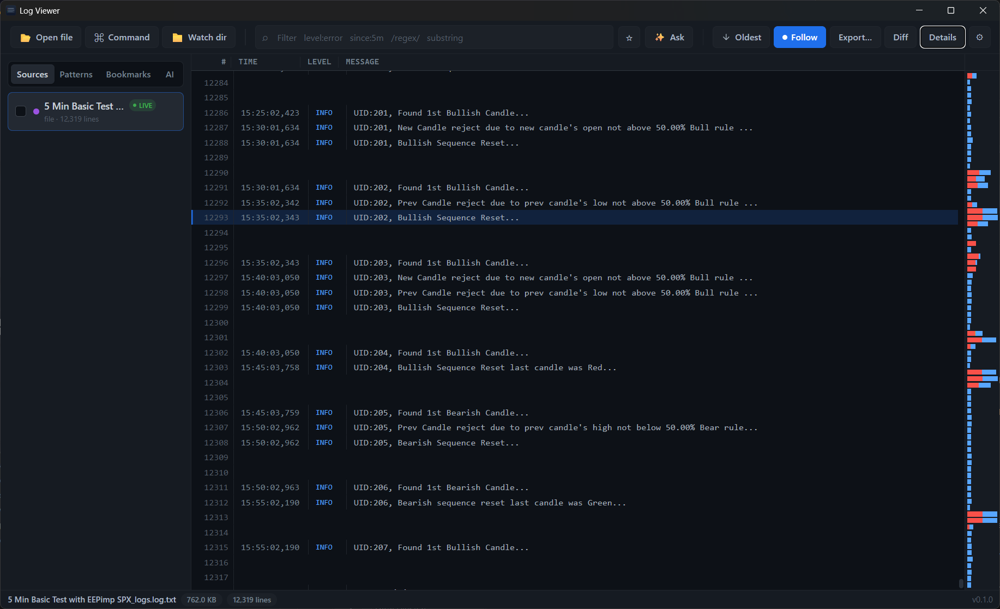

# Log Viewer

A modern, local-first desktop log viewer built with **Tauri 2 (Rust)** + **SolidJS**. Handles multi-GB files smoothly, clusters thousands of near-identical lines into a handful of templates, stitches traces across sources, and ships an opt-in AI layer that translates plain English to filters and explains errors.

> **Status:** v0.1 — feature-complete, MIT licensed, Windows-first (macOS / Linux build via Tauri's bundler).



---

## Why another log viewer

Most viewers nail one or two of these. This one tries to nail all of them:

### Core engine
- **Multi-GB files** via memory-mapped reads (`memmap2`) + sparse offset index (~8 bytes/line, SIMD newline scan with `memchr`).
- **Window-granular LRU cache** (~60 windows ≈ 15k lines resident) — open a 5 GB file, jump anywhere, no stutter.
- **Compressed logs** open natively — `.gz`, `.zst`, `.bz2` are decompressed to a temp file on the fly.
- **Live tail with `notify-rs`** — file appends are picked up automatically and auto-scroll follows.
- **Universal source pipeline** — local files, **any command's stdout** (`ssh`, `kubectl`, `journalctl`, `docker logs`, `aws logs tail`, `gcloud logging tail`, anything that prints), or **watch a directory** and new files open as they land.

### Parsing
- **Format auto-detection** — JSON, ISO 8601 (including Python `,` fractional seconds), syslog, epoch ms/sec, level keywords. No config files.
- **Continuation-line tinting** — multi-line stack traces inherit the originating level's color so an error block reads as one chunk.
- **JSON field discovery** — open a JSON-lines source, the Details → Fields tab enumerates every key seen, with example values.
- **Markdown & JSON documents** — `.md` files open with the raw text and the rendered page side by side; `.json` files get a collapsible tree. Switch between Text / Split / Preview from the bar above the viewer.

### Search & navigation
- **Filter DSL** — `level:`, `since:`, `until:`, `/regex/`, plain substrings; space-separated AND. Live debounce, instant on Enter.
- **Pattern clustering** (Drain-style) — collapses thousands of similar lines into templates with counts + level breakdowns; click a template to filter to its matches.
- **Time histogram** — vertical right-side chart with sqrt scaling and 1-in-N sampling for files >500k lines.
- **Trace stitching** — UUIDs and long hex IDs become click-to-filter chips.
- **Bookmarks with notes** — `B` to toggle; notes persist across restarts.
- **Saved views** — scoped to a source-type or global; quick recall from the toolbar.
- **Diff mode** — open two sources side-by-side, scroll-linked.
- **Merge view** — interleave selected sources by timestamp into a single virtual stream.

### AI (bring your own key — optional)
- **✨ Ask** — natural language → filter DSL (Haiku-class model, fast).
- **Explain this line** — probable cause + surrounding context (Sonnet-class, smarter).
- **Root cause** — multi-line cluster analysis across the visible window.
- **Summarize anomalies** — review of the top patterns.
- **Regex from examples** — paste 2-3 lines, get a regex back.

Providers supported out of the box: **Anthropic**, **OpenAI**, **DeepSeek**. Each provider has its own Fast + Smart model slot. System prompts use Anthropic's prompt cache, so repeated queries on the same source are cheap.

### Persistence
- **Workspace restore** — last-open sources, active source, bookmarks, last filter, all saved to `<config>/log-viewer/workspace.json` and rehydrated on startup.
- **Recent files**, **welcome card**, **guided tour**, **keybinding remap**, **theme picker** (5 presets + Custom), level palette, font/density controls — all persisted in `localStorage`.

### UX polish
- **Guided spotlight tour** — 15 steps highlighting each control with a box-shadow cutout; auto-flips placement when clipped.
- **Keybinding remap** with conflict auto-swap.
- **Drag-drop** files onto the window; **CLI launcher** opens paths into the running instance (`log-viewer foo.log`).
- **Export slice** — write the current filtered view to `.log`, `.txt`, or `.jsonl`.
- **Themes** — GitHub Dark, Dracula, Tokyo Night, Solarized Dark, Monokai, plus Custom.

---

## Filter DSL

```
level:LEVELS         e.g. level:error,warn
since:DURATION       e.g. since:5m, since:1h, since:30s
until:DURATION
/REGEX/              case-insensitive PCRE; escape '/' as \/
WORD                 case-insensitive substring on the raw line
```

Terms are space-separated, combined with AND. Examples:

- `level:error since:10m` — errors in the last 10 minutes
- `level:warn,error payment` — warnings/errors mentioning "payment"
- `/conn\w+ refused/ since:1h` — connection-refusal patterns this hour
- `/path:\/api\/users/` — regex with an escaped slash

---

## Keyboard

All shortcuts are remappable in Settings → Keybindings.

| Default     | Action                                         |
|-------------|------------------------------------------------|
| `B`         | Toggle bookmark on selected line               |
| `/`         | Focus filter                                   |
| `Esc`       | Clear filter (when focused)                    |
| `Enter`     | Apply filter immediately (skip debounce)       |
| `D`         | Toggle Details panel                           |
| `T`         | Toggle live tail (follow)                      |
| `O`         | Toggle log order (newest/oldest first)         |
| `Ctrl+O`    | Open file…                                     |
| `Ctrl+K`    | Open command…                                  |
| `Ctrl+,`    | Open Settings                                  |
| `Shift+A`   | Ask AI                                         |
| `?`         | Toggle keybinding help                         |

---

## Install

Pre-built installers are on the [Releases](https://github.com/Abhi-AlgoForge/log-viewer/releases) page:

- Windows: `.msi` (policy-managed deployments) or `.exe` (NSIS, recommended)
- macOS: `.dmg` (build locally with `npm run tauri build` for now)
- Linux: `.AppImage` + `.deb` (build locally)

After installation, log files (`.log`, `.ndjson`, `.jsonl`) get an "Open with Log Viewer" entry via the bundled file association.

### Windows SmartScreen warning

The installers are **unsigned** (code-signing certs cost $200–600/yr; this is a free OSS project). On first run Windows shows:

> **Windows protected your PC**
> Microsoft Defender SmartScreen prevented an unrecognised app from starting…

Click **More info → Run anyway**. The app itself is fully local and doesn't make any outbound calls except the AI features you opt into (and those go directly to whichever provider you configured). The source for everything in this binary is in this repo — you can also build from source yourself if you'd rather not trust the release bundle.

---

## Development

Requirements: **Rust 1.80+**, **Node 20+**.

```bash
npm install
npm run tauri dev
```

First build takes 3-5 minutes; subsequent runs are seconds.

### Tests

```bash
# Rust unit tests (parser, filter, cluster, …)
cd src-tauri && cargo test

# Frontend (Vitest)
npm test
```

### Type-check

```bash
npm run typecheck
```

### Build installers locally

```bash
npm run tauri build
```

Output lands in `src-tauri/target/release/bundle/`.

---

## Architecture

```
┌─ Tauri 2 shell ──────────────────────────────────────┐
│  Frontend (SolidJS + Tailwind v4, TanStack Virtual)  │
│    central session store · filter DSL parser ·       │
│    virtualized rows · histogram · spotlight tour     │
│                  ↕ typed IPC (JSON)                  │
│  Rust core:                                          │
│    ├ source/        file + command (subprocess)      │
│    ├ index/         sparse line-offset (memchr)      │
│    ├ parse/         JSON / ISO / syslog / level      │
│    ├ filter/        DSL parser                       │
│    ├ search/        background filter scan           │
│    ├ cluster/       Drain-style template tree        │
│    ├ histogram/     time histogram + sampling        │
│    ├ tail/          notify-rs file watcher           │
│    ├ merge/         multi-source timestamp merge     │
│    ├ ai/            Anthropic / OpenAI / DeepSeek    │
│    ├ persistence/   workspace.json round-trip        │
│    └ state/         per-source mutable state         │
└──────────────────────────────────────────────────────┘
```

All heavy work (indexing, filter scans, clustering, histogram) runs on background threads and emits typed progress events to the frontend; the UI stays responsive on multi-GB sources.

---

## Configuration paths

- **Workspace** (open sources, bookmarks, last filter): `<config-dir>/log-viewer/workspace.json`
- **AI keys** (per provider, never sent anywhere except that provider): `<config-dir>/log-viewer/ai.json`
- **Frontend prefs** (theme, keybindings, recent files, saved views, tour-seen flag): browser `localStorage` inside the WebView

Where `<config-dir>` is:

| OS      | Path                                              |
|---------|---------------------------------------------------|
| Windows | `%APPDATA%\log-viewer\`                           |
| macOS   | `~/Library/Application Support/log-viewer/`       |
| Linux   | `$XDG_CONFIG_HOME/log-viewer/` (or `~/.config/`)  |

---

## Privacy

- The app is local-first. No telemetry, no analytics, no auto-uploads.
- AI features are opt-in and only activate after you paste an API key into Settings → AI. Requests go directly from the Rust process to your chosen provider over TLS (rustls).
- Compressed source files are decompressed into `<TEMP>/log-viewer/` and wiped on app close (and clearable manually from Settings → Storage).

---

## License

MIT — see [LICENSE](LICENSE).

---

## Support development ☕

This is free and open source. If it saved you time, a coffee is appreciated:

| Chain | Address |
|---|---|
| **ETH** (EVM) | `0x0610Ee1a2d9BdF485bACEea2aca97011f7f574e2` |
| **BTC** | `bc1qec9ty5nn3l52yq3svkn43epech6ejqnlumq73v` |
| **SOL** | `EwnvQswau4hhp9HXMiuHuTwYrsqe71xfhUM868a2fWyX` |

Or just star the repo — that helps too.

